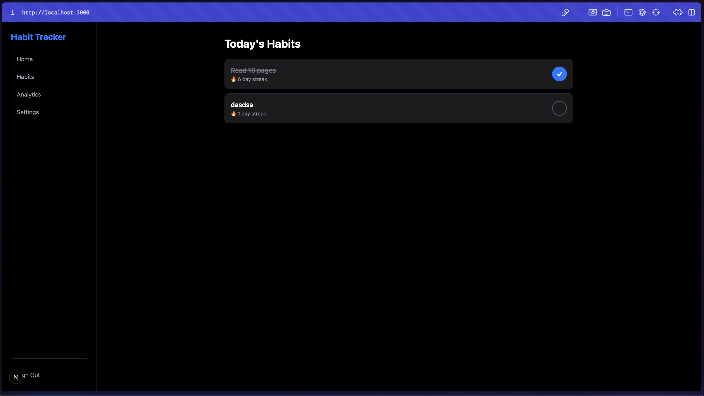

# ⚡ Habit Tracker (Offline-First)

A modern, high-performance, and gamified habit tracking application built with an offline-first architecture. This project is a monorepo supporting both **Web** (Next.js) and **Mobile** (React Native/Expo) platforms with a shared design system.



---

## 🏗️ Architecture & Tech Stack

This project leverages a modern monorepo structure using **Turborepo** for efficient builds and shared logic.

- **Frontend (Web):** [Next.js](https://nextjs.org/) (React 19) + [TailwindCSS](https://tailwindcss.com/)
- **Frontend (Mobile):** [React Native](https://reactnative.dev/) + [Expo](https://expo.dev/) + [NativeWind](https://www.nativewind.dev/)
- **Database (Offline-First):** [WatermelonDB](https://nozbe.github.io/WatermelonDB/) (SQLite for Mobile, LokiJS for Web)
- **Backend & Auth:** [Supabase](https://supabase.com/) (PostgreSQL + Realtime Sync)
- **State Management:** [Zustand](https://docs.pmnd.rs/zustand/getting-started/introduction)
- **Styling:** Shared Design System using Tailwind tokens across Web and Mobile.

---

## ✨ Key Features

- **🚀 Offline-First:** First-class support for offline usage. Your data is always available, and changes sync automatically when you're back online.
- **🔄 Seamless Sync:** Real-time data synchronization between the Web and Mobile applications via Supabase.
- **🎮 Gamification:** Stay motivated with habit streaks, visual progress indicators, and celebratory "Confetti" rewards for completion.
- **📱 Cross-Platform:** A unified experience across browsers and mobile devices.
- **🛠️ Extensible Schema:** Built on a robust relational database schema designed for performance and scale.

---

## 🛠️ Getting Started

### Prerequisites

- [Node.js](https://nodejs.org/) (>= 18)
- [npm](https://www.npmjs.com/)
- [Supabase account](https://supabase.com/) (for backend/sync)

### 1. Installation

From the root directory, install all dependencies:

```bash
npm install
```

### 2. Environment Setup

Configure your environment variables for both `apps/web` and `apps/mobile`:

- Create a `.env.local` in `apps/web`
- Create a `.env` in `apps/mobile`

Required variables:
- `NEXT_PUBLIC_SUPABASE_URL` / `EXPO_PUBLIC_SUPABASE_URL`
- `NEXT_PUBLIC_SUPABASE_ANON_KEY` / `EXPO_PUBLIC_SUPABASE_ANON_KEY`

### 3. Development

Run the development servers:

#### 🌐 Web (Next.js)
```bash
npm run dev --filter=web
# Accessible at http://localhost:3000
```

#### 📱 Mobile (Expo)
```bash
cd apps/mobile
npm run start
```
- Press `i` for iOS Simulator.
- Press `a` for Android Emulator.
- Use the **Expo Go** app to scan the QR code for physical device testing.

---

## 🤖 Built with Antigravity

This entire application was architected and implemented using **Antigravity**, a powerful agentic AI coding assistant. 

### How it was made:
- **Guided Evolution**: From the initial concept of an "offline-first habit tracker" to a fully functional monorepo.
- **Prompt-Driven Development**: Every major feature—from WatermelonDB integration to Supabase sync and the shared UI components—was developed through iterative prompting and collaborative pair-programming with Antigravity.
- **AI-Powered Refactoring**: Antigravity helped manage the complexity of a monorepo, ensuring consistency between Web and Mobile while optimizing for performance.

> This project serves as a showcase of what is possible when human creativity meets the advanced capabilities of agentic AI.

---

## 📄 License

This project is licensed under the MIT License.
